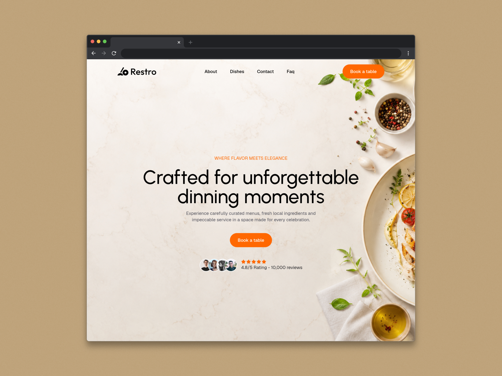

# Resto - Premium Restuarant Landing page

A sleek, responsive, and high-performance landing page designed for modern dining establishments. Built with React, Tailwind CSS, Vite, Framer Motion, Lenis Smooth Scroll, and Lucide Icons.

## Live link

The project is deployed on Vercel and can be viewed using [this link]("https://restro-landing-page-rosy.vercel.app/")

## Features

- Smooth Scrolling: Powered by Lenis for an immersive, fluid scrolling experience across all sections.
- Dynamic Animations: Micro-interactions and scroll-triggered animations driven by Framer Motion.
- Modern UI/UX: Clean layout built with Tailwind CSS, featuring dark/light aesthetic accents, interactive menus, and clean visual hierarchy.
- Interactive Components: Interactive food & drink menus, online table reservation form, customer testimonials, and contact section with map integration placeholders.
- Fully Responsive: Optimized across mobile, tablet, and desktop viewports.
- Lightweight Icons: Crisp vector icons using Lucide React.

## Tech Stack

- Framework: React 19
- Build Tool: Vite
- Styling: Tailwind CSS
- Animations: Framer Motion
- Smooth Scroll: Lenis (@studio-freight/lenis)
- Icons: Lucide React (lucide-react)

## Preview

## License

This project is open-source and available under the MIT License.
